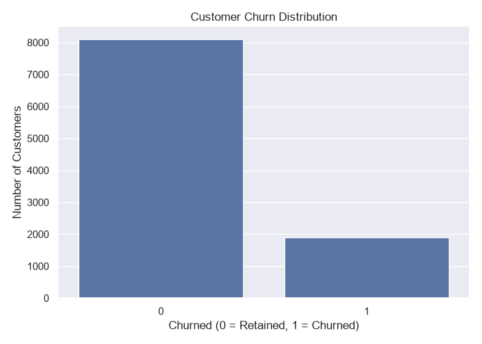
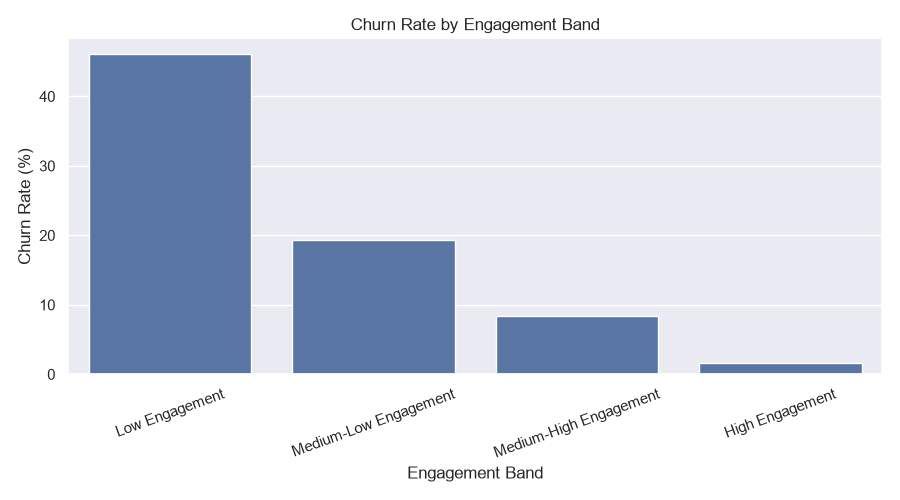
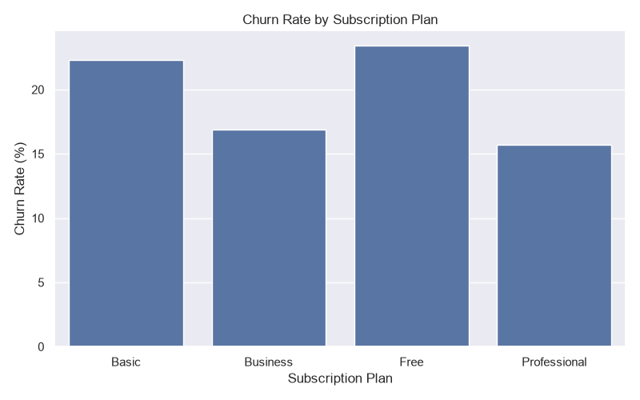
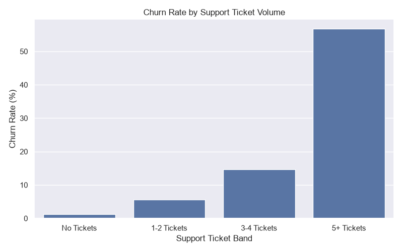

# Flowly — Customer Churn & Retention Analytics

## 1. Project Overview

Flowly is a simulated SaaS business used to investigate customer churn, engagement, support experience, payment activity, and customer revenue.

This end-to-end analytics project demonstrates how data can be generated, audited, cleaned, validated, analyzed, and transformed into business insights and retention recommendations using Python, MySQL, and Power BI.

**Important:** Flowly and its dataset are fictional. The results describe the simulated dataset and should not be interpreted as findings about a real company or its customers.

## 2. Business Problem

Customer churn can affect recurring revenue and long-term business growth. A business needs to understand which customer groups are leaving, how their engagement differs, and what areas may deserve further investigation.

This project explores questions such as:

* What proportion of customers churned in the simulated dataset?
* How does churn vary across subscription plans and engagement levels?
* How is support-ticket volume associated with churn?
* What churn reasons were recorded, and how do they compare with transaction evidence?
* Which customer groups could be considered for retention experiments?
* What metrics could management monitor to evaluate future retention initiatives?

## 3. Tools and Technologies

* **Python:** Data generation, auditing, cleaning, validation, exploratory data analysis
* **Pandas:** Data manipulation and aggregation
* **MySQL 8:** Relational data storage, SQL validation, analysis, and customer-level analytical table
* **Power BI:** Interactive dashboards and business reporting
* **Excel / CSV:** Data inspection and exchange
* **GitHub:** Project version control and presentation

## 4. Project Workflow

1. Generate linked simulated business datasets using Python.
2. Audit the raw data and investigate data-quality issues.
3. Clean the data and validate the cleaned outputs.
4. Load the datasets into MySQL and run SQL checks and analyses.
5. Build a customer-level analytical table while avoiding join fan-out.
6. Conduct Python EDA and investigate churn, engagement, support, and payments.
7. Build Power BI dashboards for executive and operational analysis.
8. Document findings, limitations, and proposed retention experiments.

## 5. Dataset

The simulated project contains seven related datasets:

| Dataset                      | Description                                            |
| ---------------------------- | ------------------------------------------------------ |
| `customers.csv`              | Customer attributes and acquisition details            |
| `subscriptions.csv`          | Plans, billing cycles, prices, and subscription status |
| `transactions.csv`           | Transaction dates, amounts, methods, and statuses      |
| `customer_activity.csv`      | Sessions, usage, projects, uploads, and activity       |
| `support_tickets.csv`        | Support issues, resolution times, and satisfaction     |
| `marketing_interactions.csv` | Campaign, channel, and interaction information         |
| `churn_events.csv`           | Churn dates, recorded reasons, and churn types         |

The data was generated programmatically with a fixed random seed for reproducibility. Controlled data-quality issues were included to demonstrate audit and cleaning techniques.

## 6. Selected Findings

The following are descriptive results from the simulated dataset:

* **10,000** customers were included in the customer-level analytical table.
* **1,903 customers churned**, giving an overall churn rate of **19.03%**.
* Churn rates differed across subscription plans and engagement bands.
* The lowest engagement band had a churn rate of **46.03%**, while the highest engagement band had a churn rate of **1.62%**.
* Customers with five or more support tickets had a churn rate of **56.74%** in the analyzed dataset.
* Recorded churn reasons and transaction evidence did not fully overlap, so payment-related conclusions require caution.

These are associations and descriptive observations, not proof that any single factor caused churn.

## 7. Dashboard Preview

### Customer Churn Overview

### Churn by Engagement

### Churn by Subscription Plan

### Churn by Support Ticket Volume

### Power BI Executive Overview

### Power BI Engagement & Support

### Power BI Revenue & Segmentation

## 8. Retention Recommendations

The project proposes areas for further testing, including:

* Early engagement support for low-engagement customers.
* Reviewing high support-ticket volume and escalation patterns.
* Conducting plan-specific customer research.
* Investigating payment-related churn labels against transaction timelines.
* Exploring low-usage churn and potential onboarding improvements.

These are proposed interventions and hypotheses. Their effectiveness would need to be evaluated through properly designed experiments or other suitable measurement approaches.

## 9. Limitations

* The company and data are simulated rather than real.
* Findings reflect the assumptions and rules used by the data generator.
* Observed associations do not establish causation.
* Churn labels and transaction records may not align perfectly.
* Recommendations require validation using real business data before implementation.

## 10. Reproducibility and Documentation

Supporting documentation is available in `05_documentation/`:

* `DATA_PROVENANCE.md`
* `HOW_TO_RECREATE.md`
* `DATA_QUALITY_REPORT.md`
* `EDA_FINDINGS.md`
* `RETENTION_PLAYBOOK.md`

Python scripts are in `02_python/`, SQL scripts are in `03_sql/`, and the Power BI report files and materials belong in `04_powerbi/`.

Refer to `HOW_TO_RECREATE.md` for the project reproduction instructions.

## 11. Project Objective

The objective of this project is to demonstrate a complete analytics workflow—from data generation and quality assurance to SQL analysis, dashboard reporting, and evidence-based business recommendations—while clearly documenting assumptions and limitations.
